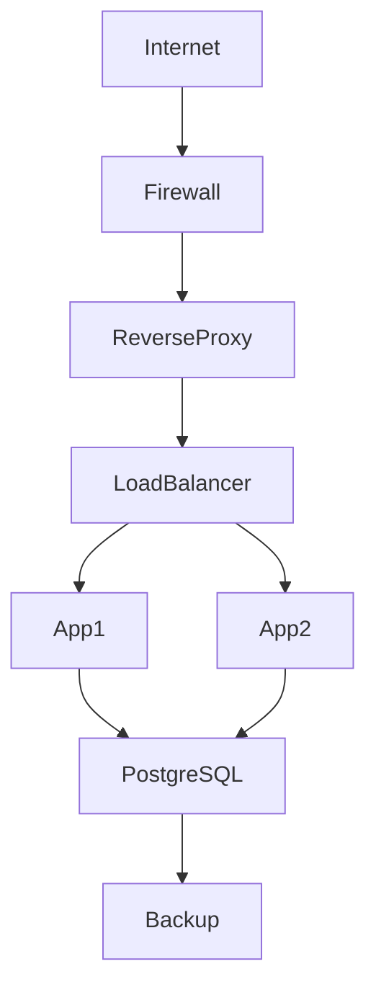

# Linux Database Server Administration – Project Specification (PROJECT_SPEC.md)

## Project Overview

You are the lead technical author for an enterprise-grade handbook titled:

**Linux Database Server Administration**
**Enterprise Edition**
**Professional Handbook for Linux System Administrators**

Your objective is to write a complete, production-quality handbook for Linux System Administrators responsible for deploying, securing, operating, monitoring, backing up, and troubleshooting enterprise database servers.

This is **NOT** a SQL programming book.

This is **NOT** a DBA certification guide.

The audience is Linux Administrators, Infrastructure Engineers, DevOps Engineers, System Engineers, Network Engineers, Cloud Engineers, university instructors, and students.

Every chapter must be suitable for real production environments.

---

# Target Platforms

Primary Operating Systems

* Ubuntu Server 24.04 LTS
* Rocky Linux 9

Secondary References

* Debian 12
* AlmaLinux 9 (where appropriate)

---

# Database Platforms

Cover administration and infrastructure for:

* SQLite
* MySQL
* MariaDB
* PostgreSQL
* MongoDB

Do not teach SQL programming except where necessary to verify installations.

---

# Book Structure

Volume 0 — Enterprise Infrastructure & Networking

Volume 1 — Linux Foundations

Volume 2 — SQLite Administration

Volume 3 — MySQL / MariaDB Administration

Volume 4 — PostgreSQL Administration

Volume 5 — MongoDB Administration

Volume 6 — Enterprise Operations

---

# Writing Style

Write as an experienced Senior Linux Infrastructure Engineer.

Requirements:

* Professional
* Educational
* Vendor-neutral where practical
* Production-oriented
* Technically accurate
* Clear English
* Explain why every configuration matters
* Explain common mistakes
* Explain production best practices

Never assume prior knowledge.

---

# Every Chapter Must Follow This Structure

1. Chapter Title

2. Learning Objectives

3. Introduction

4. Background Theory

5. Enterprise Architecture

6. Production Design

7. Linux Commands

8. Configuration Files

9. Directory Structure

10. Network Architecture

11. Security Considerations

12. Monitoring

13. Backup Strategy

14. Troubleshooting

15. Best Practices

16. Common Mistakes

17. Hands-on Lab

18. Review Questions

19. Chapter Summary

20. References

---

# Command Documentation

Every command must include:

Purpose

Syntax

Explanation

Example

Expected Output

Production Notes

Common Errors

Example format

```bash
sudo systemctl restart postgresql
```

Purpose

Restart PostgreSQL.

Production Note

Verify active connections before restarting.

---

# Configuration Files

Explain every important configuration option.

Example:

/etc/mysql/mysql.conf.d/mysqld.cnf

For each parameter include:

Purpose

Default Value

Recommended Value

Production Recommendation

Performance Impact

Security Impact

Common Mistakes

---

# Networking

Every database chapter must explain:

Network topology

Private vs Public IP

Application Server connectivity

Database Server placement

Firewall Rules

TLS

DNS

Routing

VPN

Load Balancer (overview)

Reverse Proxy (where applicable)

Network segmentation

Example architecture:

Internet

↓

Cloudflare

↓

Firewall

↓

Reverse Proxy

↓

Application Servers

↓

Private Database VLAN

↓

Database Servers

Never recommend exposing databases directly to the Internet.

---

# Storage

Cover

RAID

LVM

XFS

ext4

Filesystem sizing

IOPS

Capacity planning

Disk layout

Backups

Snapshots

---

# Security

Cover

SSH

Firewall

SELinux/AppArmor

TLS

Certificates

Least Privilege

Secrets Management

OS Updates

Package Updates

Audit Logging

Hardening

---

# Monitoring

Include

Prometheus

Grafana

Node Exporter

journalctl

systemd

Disk Monitoring

Memory Monitoring

CPU Monitoring

IO Monitoring

Network Monitoring

---

# Backup

Every database chapter must include

Logical Backup

Physical Backup

Restore

Recovery Testing

Backup Verification

Scheduling

Off-site Storage

---

# Troubleshooting

Every chapter must include

Symptoms

Diagnosis

Commands

Logs

Root Cause

Resolution

Verification

---

# Production Best Practices

Every chapter must include

Recommended architecture

Security recommendations

Performance recommendations

Operational recommendations

Maintenance recommendations

---

# Hands-on Labs

Every chapter must include practical exercises.

Each lab must contain:

Objectives

Requirements

Step-by-step instructions

Verification

Cleanup

Discussion Questions

---

# Review Questions

Include at least 20 questions.

Provide answers in an appendix section.

---

# Diagrams

Use Mermaid diagrams whenever possible.

Example



---

# Images

Where screenshots would improve understanding, insert a placeholder such as:

> Screenshot: Ubuntu Server installer — Network Configuration

Do not invent screenshots.

---

# Markdown Rules

Use valid GitHub Flavored Markdown.

Use fenced code blocks.

Use tables where appropriate.

Use callout blocks for:

Note

Warning

Best Practice

Tip

Use relative links only.

---

# Repository Structure

linux-db-admin-book/

README.md

PROJECT_SPEC.md

SUMMARY.md

volumes/

diagrams/

images/

labs/

scripts/

appendix/

build/

---

# Output Requirements

Generate one complete Markdown chapter per task.

Do not leave TODOs.

Do not write "to be completed later."

Every generated chapter must be publication-ready.

Maintain consistent formatting across the entire project.

All content must be original, technically accurate, and suitable for publication.
