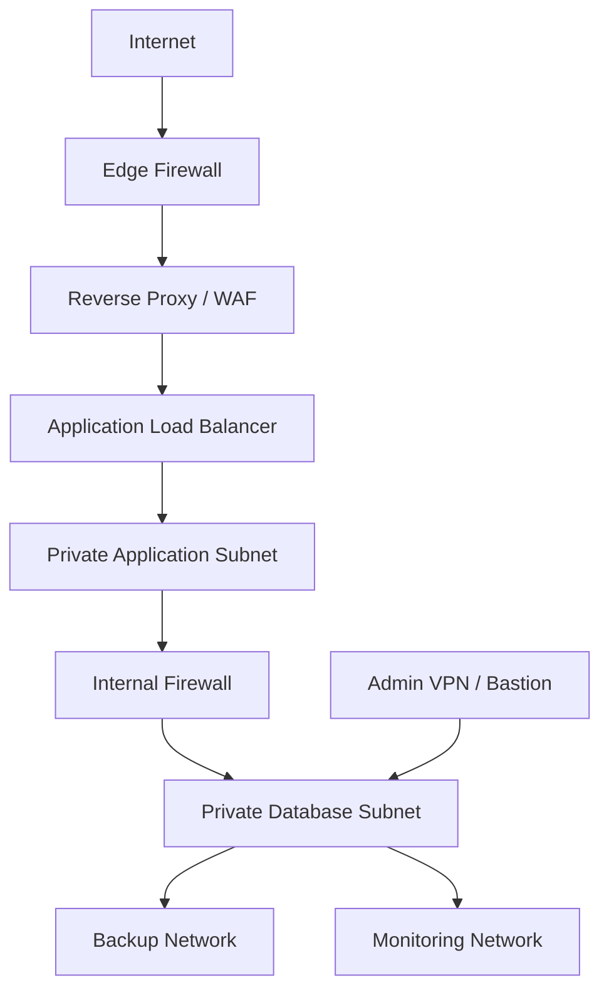

# Chapter 1: Enterprise Linux Database Server Architecture

## Learning Objectives

By the end of this chapter, you will be able to:

1. Explain the role of Linux administrators in database server operations.
2. Design a secure network placement model for database servers.
3. Select baseline storage, operating system, monitoring, and backup controls for production database hosts.
4. Document administrative commands with purpose, syntax, expected output, production notes, and common errors.
5. Build a hands-on lab that validates service reachability without exposing database ports to the Internet.

## Introduction

Enterprise database servers are infrastructure systems before they are database systems. A reliable database deployment depends on the Linux operating system, storage layout, network segmentation, identity controls, patching process, monitoring stack, backup design, and operational runbooks. This handbook focuses on those responsibilities from the perspective of Linux system administrators and infrastructure engineers.

This chapter establishes the common architecture used throughout the book for SQLite, MySQL, MariaDB, PostgreSQL, and MongoDB. It does not teach SQL programming. SQL appears only where a simple query is useful to verify that a service is installed and reachable.

> **Best Practice:** Treat every database server as a protected infrastructure asset. Database ports should be reachable only from approved application, administration, monitoring, and backup networks.

## Background Theory

A production Linux database platform has four major layers:

| Layer | Administrator Responsibility | Why It Matters |
|---|---|---|
| Operating system | Package lifecycle, kernel updates, users, services, security modules, logs | An unstable or unpatched OS can take every database offline. |
| Storage | Filesystems, LVM, RAID, mount options, snapshots, I/O capacity | Databases are sensitive to latency, write ordering, and full filesystems. |
| Network | IP addressing, routing, DNS, firewalls, TLS paths, segmentation | Most database incidents involve unauthorized access, misrouting, or unplanned exposure. |
| Operations | Monitoring, backups, restore tests, incident response, change control | Backups and dashboards are not useful unless they are verified before failure. |

The primary platforms for this handbook are Ubuntu Server 24.04 LTS and Rocky Linux 9. Ubuntu 24.04 LTS is a long-term support release with standard security maintenance through May 31, 2029. Rocky Linux 9 follows the enterprise Linux family model and commonly uses `firewalld`, SELinux, `dnf`, and systemd-based service management.

## Enterprise Architecture

A typical enterprise deployment separates users, application servers, database servers, monitoring systems, and backup systems into distinct network zones.



Production database servers should normally have:

- A private IP address for application traffic.
- A restricted management path through VPN, bastion host, or privileged access workstation.
- A backup interface or route to backup storage.
- Monitoring access from Prometheus, Grafana Agent, or another approved collector.
- No direct Internet exposure for database listener ports.

## Production Design

### Baseline Host Design

| Component | Ubuntu Server 24.04 LTS | Rocky Linux 9 | Production Recommendation |
|---|---|---|---|
| Service manager | systemd | systemd | Manage database services with systemd units and change windows. |
| Firewall | `ufw` or nftables | `firewalld` | Use host firewalls even when cloud security groups exist. |
| Mandatory access control | AppArmor | SELinux | Keep enabled; tune policy rather than disabling controls. |
| Package manager | `apt` | `dnf` | Use pinned repositories and tested maintenance windows. |
| Filesystem | ext4 or XFS | XFS or ext4 | Use XFS for large database volumes unless application guidance requires otherwise. |
| Time sync | `systemd-timesyncd` or chrony | chrony | Require accurate time for TLS, logs, replication, and incident response. |

### Capacity Planning

Plan database capacity using measurable inputs:

- Current database size.
- Daily data growth.
- Index growth.
- Write volume and peak IOPS.
- Backup retention period.
- Restore time objective (RTO).
- Recovery point objective (RPO).
- Replication and maintenance overhead.

A conservative initial formula for database storage is:

```text
required_capacity = active_data + indexes + 30_percent_free_space + backup_staging + maintenance_workspace
```

> **Warning:** A database filesystem that reaches 100% usage can corrupt service availability, prevent checkpoints, stop replication, or block emergency maintenance.

## Linux Commands

### `systemctl status`

**Purpose:** Check whether a database or infrastructure service is running.

**Syntax:**

```bash
sudo systemctl status SERVICE_NAME
```

**Explanation:** `systemctl` queries systemd. Replace `SERVICE_NAME` with a unit such as `postgresql`, `mysql`, `mariadb`, `mongod`, `node_exporter`, or `firewalld`.

**Example:**

```bash
sudo systemctl status firewalld
```

**Expected Output:**

```text
● firewalld.service - firewalld - dynamic firewall daemon
     Loaded: loaded (/usr/lib/systemd/system/firewalld.service; enabled)
     Active: active (running)
```

**Production Notes:** Use `systemctl status` before and after planned changes. Capture the output in change records when modifying database services.

**Common Errors:**

- `Unit SERVICE_NAME could not be found`: the package is not installed or the service name differs by distribution.
- `Active: failed`: inspect `journalctl -u SERVICE_NAME` before restarting repeatedly.

### `ss -tulpen`

**Purpose:** Identify listening TCP/UDP sockets and confirm whether database ports are bound to private addresses.

**Syntax:**

```bash
sudo ss -tulpen
```

**Explanation:** `ss` displays socket information. The options show TCP, UDP, listening sockets, process names, extended details, and numeric ports.

**Example:**

```bash
sudo ss -tulpen | grep -E ':(3306|5432|27017)'
```

**Expected Output:**

```text
tcp LISTEN 0 4096 10.20.30.15:5432 0.0.0.0:* users:(("postgres",pid=1842,fd=7))
```

**Production Notes:** A database listener on `0.0.0.0` is not automatically wrong, but it must be paired with host firewall rules, network ACLs, and database authentication controls. Prefer binding to private interfaces where supported.

**Common Errors:**

- No output: the service is stopped or listening on a different port.
- Listener on public IP: immediately validate firewall exposure and routing.

### `journalctl -u`

**Purpose:** Read systemd journal entries for a service.

**Syntax:**

```bash
sudo journalctl -u SERVICE_NAME --since "1 hour ago"
```

**Explanation:** `journalctl` reads structured logs from the systemd journal. The `--since` filter reduces noise during incident response.

**Example:**

```bash
sudo journalctl -u postgresql --since "15 minutes ago"
```

**Expected Output:**

```text
Jul 07 10:15:22 db01 postgresql[1204]: database system is ready to accept connections
```

**Production Notes:** Always correlate service logs with kernel logs, disk alerts, authentication logs, and network changes.

**Common Errors:**

- `-- No entries --`: the service name may be wrong or logs may be stored in a database-specific log directory.
- Permission denied: run with `sudo` or a delegated operations role.

### `firewall-cmd --list-all`

**Purpose:** Review active firewalld zone rules on Rocky Linux and other enterprise Linux systems.

**Syntax:**

```bash
sudo firewall-cmd --list-all
```

**Explanation:** `firewall-cmd` manages firewalld runtime and permanent firewall configuration. Firewalld uses zones to apply different trust levels to interfaces and sources.

**Example:**

```bash
sudo firewall-cmd --zone=internal --list-all
```

**Expected Output:**

```text
internal (active)
  interfaces: ens192
  services: ssh
  ports: 5432/tcp
  sources: 10.20.10.0/24
```

**Production Notes:** Make database rules source-specific. Avoid opening database ports to an entire corporate network when only application subnets require access.

**Common Errors:**

- Runtime rule works until reboot: add `--permanent` and reload after approval.
- Wrong zone: verify interface-to-zone mapping with `firewall-cmd --get-active-zones`.

### `df -h` and `df -i`

**Purpose:** Check filesystem capacity and inode availability.

**Syntax:**

```bash
df -h

df -i
```

**Explanation:** `df -h` reports human-readable space usage. `df -i` reports inode usage, which matters for workloads that create many small files.

**Example:**

```bash
df -h /var/lib/postgresql
```

**Expected Output:**

```text
Filesystem      Size  Used Avail Use% Mounted on
/dev/mapper/vgdb-pgdata  500G  310G  190G  63% /var/lib/postgresql
```

**Production Notes:** Alert before database filesystems exceed 80% usage and require an escalation path at 90%.

**Common Errors:**

- Checking `/` instead of the database mount point.
- Ignoring inode exhaustion on log or spool directories.

## Configuration Files

| File | Platform | Purpose | Production Guidance |
|---|---|---|---|
| `/etc/ssh/sshd_config` | All | SSH daemon configuration | Disable password login where possible and require key-based access through a bastion or VPN. |
| `/etc/fstab` | All | Persistent filesystem mounts | Use stable device identifiers and test boot behavior after storage changes. |
| `/etc/security/limits.conf` or `/etc/security/limits.d/*.conf` | All | Process limits | Configure database-specific open-file and process limits based on vendor guidance. |
| `/etc/sysctl.conf` or `/etc/sysctl.d/*.conf` | All | Kernel runtime parameters | Document every change and validate with load testing. |
| `/etc/firewalld/zones/*.xml` | Rocky Linux 9 | Persistent firewalld zones | Review in change control and keep source-specific database rules. |
| `/etc/ufw/*.rules` | Ubuntu Server | UFW rules | Use explicit allow rules from application subnets only. |

### Example Parameter: SSH Password Authentication

| Item | Value |
|---|---|
| Purpose | Controls whether users can authenticate to SSH using passwords. |
| Default Value | Distribution-dependent. |
| Recommended Value | `PasswordAuthentication no` for production servers with approved key management. |
| Production Recommendation | Combine with bastion access, MFA, named user accounts, and emergency break-glass procedure. |
| Performance Impact | None. |
| Security Impact | Reduces password spraying and brute-force risk. |
| Common Mistakes | Disabling passwords before validating key access and break-glass access. |

## Directory Structure

Common database-related directories include:

| Directory | Purpose | Notes |
|---|---|---|
| `/var/lib` | Default location for service data directories | Often contains database data directories. Use dedicated mounts for production. |
| `/var/log` | Operating system and service logs | Ensure logs cannot fill the root filesystem. |
| `/etc` | Configuration files | Track critical changes in configuration management. |
| `/run` | Runtime sockets and PID files | Temporary; recreated at boot. |
| `/backup` or `/srv/backup-staging` | Local backup staging | Do not use as the only backup location. Replicate off-host. |
| `/opt` | Third-party tools | Use only when packages are not available from approved repositories. |

## Network Architecture

Database servers belong on private networks. Application servers connect over private IPs or private service discovery names. Administrators connect through VPN or bastion hosts. Monitoring and backup systems use tightly scoped firewall rules.

### Firewall Rule Model

| Source | Destination | Port | Action | Reason |
|---|---|---:|---|---|
| Application subnet | Database private IP | DB-specific port | Allow | Application connectivity. |
| Monitoring subnet | Database private IP | Exporter port | Allow | Metrics collection. |
| Backup subnet | Database private IP | SSH or backup agent port | Allow | Backup and restore workflows. |
| Admin VPN/bastion | Database private IP | SSH | Allow | Controlled administration. |
| Internet | Database private IP/public IP | Any database port | Deny | Databases must not be directly exposed. |

### DNS and TLS

Use internal DNS names such as `postgresql-prod-01.db.example.internal`. TLS certificates should match the internal service name and be issued by an approved enterprise CA or trusted private PKI. Certificate expiration must be monitored.

### Load Balancers and Reverse Proxies

Reverse proxies are common for HTTP applications but are not a substitute for database authentication or encryption. Some database platforms support TCP load balancing or proxies, but those designs require careful health checks, transaction behavior analysis, and failover testing.

## Security Considerations

Production database servers require defense in depth:

- Use named administrator accounts instead of shared root access.
- Require SSH keys, MFA, bastion hosts, or VPN for administration.
- Keep SELinux or AppArmor enabled.
- Restrict database ports to approved sources.
- Encrypt client connections with TLS when traffic crosses host or trust boundaries.
- Store credentials in a secrets manager, not shell history or plain-text scripts.
- Apply operating system updates through a tested patch process.
- Enable audit logging for privileged access and configuration changes.

> **Warning:** Disabling SELinux or AppArmor to make an installation work hides the real problem. Tune policy or file contexts instead.

## Monitoring

A production monitoring baseline should include:

| Metric Area | Examples | Why It Matters |
|---|---|---|
| CPU | utilization, load average, steal time | High CPU can indicate inefficient queries, backup compression pressure, or undersizing. |
| Memory | available memory, swap usage, OOM kills | Databases rely heavily on memory and may fail badly under memory pressure. |
| Disk | capacity, inode usage, latency, IOPS | Storage saturation is a common cause of database outages. |
| Network | throughput, retransmits, dropped packets | Replication and application latency depend on stable networking. |
| Services | systemd unit state, restart count | Unexpected restarts indicate instability. |
| Logs | authentication failures, kernel errors, database errors | Logs provide root-cause evidence. |

Prometheus Node Exporter is a common way to expose Linux host metrics. Grafana can visualize those metrics and combine infrastructure views with database-specific dashboards.

## Backup Strategy

Backups must be designed before production launch.

| Backup Type | Description | Use Case |
|---|---|---|
| Logical backup | Exports database objects and data in a portable format | Small databases, migrations, selective restore. |
| Physical backup | Copies database files using a database-aware tool or snapshot method | Large databases, faster full restore, replication seeding. |
| Snapshot | Storage-level point-in-time image | Fast rollback when coordinated with database consistency requirements. |
| Off-site copy | Backup stored outside the primary failure domain | Disaster recovery and ransomware resilience. |

Backup requirements:

- Define RPO and RTO with application owners.
- Encrypt backups in transit and at rest.
- Store backups off-host and off-site.
- Test restores on a schedule.
- Monitor backup job success and backup age.
- Document restore commands and decision points.

## Troubleshooting

| Symptom | Diagnosis | Commands | Logs | Root Cause | Resolution | Verification |
|---|---|---|---|---|---|---|
| Application cannot connect | Check service state, listener, firewall, DNS | `systemctl status`, `ss -tulpen`, `firewall-cmd --list-all` | systemd journal, database logs | Service stopped, wrong bind address, blocked route | Start service, correct bind/firewall, fix DNS | Successful connection from app subnet |
| Database server slow | Check CPU, memory, disk latency, network | `top`, `vmstat`, `iostat`, `sar` | kernel logs, database slow logs | Storage contention, memory pressure, workload spike | Reduce load, tune resources, scale storage | Metrics return to baseline |
| Filesystem nearly full | Check mount usage and growth | `df -h`, `du -xh` | system logs, backup logs | Logs, failed cleanup, data growth | Add capacity, purge safe files, rotate logs | Free space above threshold |
| Backup failed | Check job status, credentials, capacity | `systemctl status`, backup tool logs | backup logs, journal | Permission, network, storage, lock issue | Fix root cause and rerun backup | Restore test succeeds |

## Best Practices

- Place database servers in private subnets.
- Keep database ports closed to the Internet.
- Use host firewalls in addition to network firewalls.
- Use dedicated filesystems for database data and logs.
- Keep at least 20% free capacity on database volumes unless a tested platform-specific threshold is stricter.
- Use configuration management for repeatable builds.
- Monitor the operating system and the database engine.
- Test restore procedures, not just backup jobs.
- Document every production change.
- Use maintenance windows for disruptive operations.

## Common Mistakes

1. Exposing database ports to public networks.
2. Treating backups as successful without restore testing.
3. Disabling SELinux or AppArmor permanently.
4. Running databases on the root filesystem without capacity planning.
5. Allowing logs or backups to fill database volumes.
6. Using shared administrator accounts.
7. Applying kernel or database updates without a rollback plan.
8. Ignoring DNS and certificate expiration.
9. Monitoring only database metrics and not host metrics.
10. Assuming cloud security groups replace host firewalls.

## Hands-on Lab

### Objectives

- Create a private-network database server checklist.
- Verify local firewall and service visibility.
- Practice documenting command output.

### Requirements

- One Ubuntu Server 24.04 LTS or Rocky Linux 9 virtual machine.
- Sudo access.
- No public database exposure.

### Step-by-Step Instructions

1. Record host identity:

   ```bash
   hostnamectl
   ip address show
   ```

2. Check systemd health:

   ```bash
   systemctl --failed
   ```

3. Review listening sockets:

   ```bash
   sudo ss -tulpen
   ```

4. Review firewall state on Rocky Linux:

   ```bash
   sudo firewall-cmd --get-active-zones
   sudo firewall-cmd --list-all
   ```

5. Review firewall state on Ubuntu when UFW is used:

   ```bash
   sudo ufw status verbose
   ```

6. Check filesystem capacity:

   ```bash
   df -h
   df -i
   ```

7. Review recent service logs:

   ```bash
   sudo journalctl --since "30 minutes ago" --priority=warning
   ```

### Verification

Confirm that:

- No database listener is exposed on a public interface.
- Firewall rules are documented.
- Filesystems have adequate free space.
- No failed systemd units require immediate action.

### Cleanup

This lab does not create persistent resources. Save your notes in your lab journal and remove any temporary files you created.

### Discussion Questions

1. Why should database servers use private IP addresses?
2. Why are restore tests more important than backup success messages?
3. What risk is introduced when a database runs on the root filesystem?
4. How do host firewalls complement network firewalls?
5. Why should administrators keep SELinux or AppArmor enabled?

## Review Questions

1. What is the primary audience for this handbook?
2. Why is this handbook not a SQL programming book?
3. Which two primary operating systems are used in this handbook?
4. Why should database ports not be exposed directly to the Internet?
5. What is the purpose of a bastion host or admin VPN?
6. What command checks the status of a systemd service?
7. What command lists listening sockets on Linux?
8. Why is filesystem capacity monitoring critical for databases?
9. What is the difference between logical and physical backups?
10. Why must backups be stored off-host?
11. What is RPO?
12. What is RTO?
13. Why should TLS certificates be monitored?
14. What is the role of Prometheus Node Exporter?
15. Why should SELinux or AppArmor not be disabled casually?
16. What is the purpose of `/etc/fstab`?
17. Why are private DNS names useful for database services?
18. What is a common risk of using shared administrator accounts?
19. Why should service logs be correlated with system metrics?
20. What should be verified after a firewall change?

## Chapter Summary

Enterprise Linux database administration begins with infrastructure discipline. The database engine matters, but production reliability depends equally on host hardening, private networking, storage planning, monitoring, backup verification, and repeatable operations. The safest default is to place databases on private networks, allow only required sources, keep operating system protections enabled, and test every restore path before an outage occurs.

## References

- Ubuntu 24.04 LTS Release Notes: <https://documentation.ubuntu.com/release-notes/24.04/>
- Rocky Linux firewalld documentation: <https://docs.rockylinux.org/10/guides/security/firewalld-beginners/>
- firewalld project documentation: <https://firewalld.org/>
- Prometheus Node Exporter guide: <https://prometheus.io/docs/guides/node-exporter/>
- Grafana Linux host monitoring guide: <https://grafana.com/docs/grafana-cloud/send-data/metrics/metrics-prometheus/prometheus-config-examples/noagent_linuxnode/>
- PostgreSQL `pg_basebackup` documentation: <https://www.postgresql.org/docs/current/app-pgbasebackup.html>
- MySQL Backup and Recovery documentation: <https://dev.mysql.com/doc/refman/8.0/en/backup-and-recovery.html>
- MariaDB Backup and Restore Overview: <https://mariadb.com/docs/server/server-usage/backup-and-restore/backup-and-restore-overview>
- MongoDB Production Notes: <https://www.mongodb.com/docs/manual/administration/production-notes/>
- SQLite Online Backup documentation: <https://sqlite.org/backup.html>
